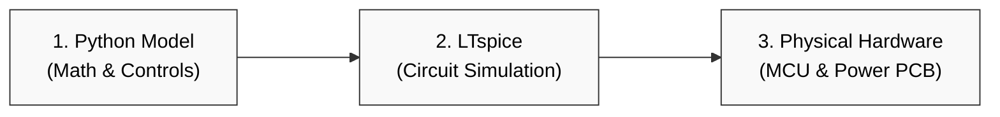

# Digital Synchronous Buck Converter: Simulation & Control

A discrete, synchronous buck converter utilizing a digital closed-loop control system. This project transitions a continuous-time power stage model into a discrete-time $z$-domain compensator implemented on a 32-bit microcontroller, bypassing traditional "black-box" integrated management ICs. Designed from the perspective of a high-efficiency satellite Electrical Power System (EPS) Point-of-Load (POL) regulator.

## System Architecture

The system consists of a Python-modeled physical plant, an LTspice circuit verification stage, and firmware executing real-time digital current/voltage control loops.


## Features & Project Milestones

- [ ] **Mathematical Modeling:** Continuous-time transfer function derivation of a second-order LC low-pass filter with non-ideal capacitor ESR.
- [ ] **Digital Control Optimization:** Bilinear transformation mapping to the $z$-domain for executing Type II/Type III digital compensators.
- [ ] **Analog Front-End Design:** Discrete differential operational amplifier circuit for high-bandwidth inductor current sensing.
- [ ] **Firmware Control Loop:** Real-time execution of control voltage updates inside a high-frequency (50 kHz) Timer Interrupt Service Routine (ISR).

## Specifications

| Parameter | Target Value |
| :--- | :--- |
| **Input Voltage ($V_{in}$)** | 12.0 V DC |
| **Output Voltage ($V_{out}$)** | 3.3 V DC |
| **Maximum Load Current ($I_{out}$)** | 2.0 A |
| **Switching Frequency ($f_{sw}$)** | 200 kHz |
| **Sampling Frequency ($f_s$)** | 50 kHz |
| **Target Efficiency** | > 92% |

## Repository Structure

```text
├── simulation/          # Python mathematical scripts & optimization notebooks
├── hardware/            # LTspice schematics and KiCad PCB layout files
├── firmware/            # C++ source code for the microcontroller (PlatformIO)
└── docs/                # Design notes, transfer function derivations, and plots
